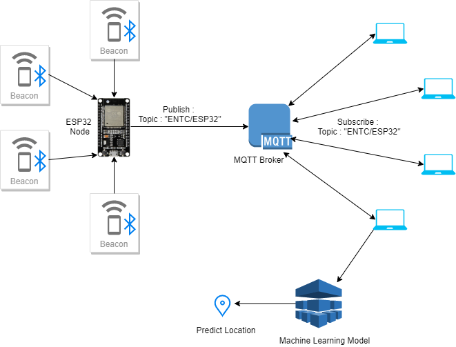

# Localization using ESP32-BLE-Beaconing

## Content

* [About the Project](#about-the-project)
  * [Built With](#built-with)
* [Architecture](#Architecture)
* [Acknowledgements](#acknowledgements)

<!-- ABOUT THE PROJECT -->
## About The Project
This ia a project on BLE beaconing based indoor localization. There are many techniques that are used to identify a location on a map with the improvement of
technology. In addition the significant and popularity of indoor navigation has increased in the
recent past. So our purpose was studying the concept of indoor navigation. Here we used BLE beacons
for that. Then BLE messages were scanned using the arduino ESP32 module. The RSSI data of received messages were uploaded to a MQTT server under a given topic using an access point. The data was collected at several places. A machine learning model(Random forest classifier had better accuracy compared to Fully connected Neural network and Support vector machine) was trained using collected data to find out the correct user locations.

### Built With

#### BLE(Bluetooth Low Energy)
Bluetooth Low Energy (BLE) or Bluetooth Smart, is the low power- version of Bluetooth that was
developed for the Internet of Things (IoT) and was introduced as part of the Bluetooth 4.0 core
specification. BLE was originally developed by Nokia as an in-house project called 'Wibree' and
soon after was adopted by the Bluetooth SIG. Bluetooth LE uses a 2.4 GHz unlicensed radio band
to interconnect nearby devices. It provides a data rate of up to 1 Mbps while consuming just 0.01
to 0.5 watts.

#### MQTT Protocol
MQTT stands for MQ Telemetry Transport. It is a publish/subscribe, extremely simple and
lightweight messaging protocol, designed for constrained devices and low-bandwidth,
high-latency or unreliable networks. The design principles are to minimise network bandwidth and
device resource requirements whilst also attempting to ensure reliability and some degree of
assurance of delivery. These principles also turn out to make the protocol ideal of the emerging
“machine-to-machine” (M2M) or “Internet of Things” world of connected devices, and for mobile
applications where bandwidth and battery power are at a premium. The MQTT protocol defines
two types of network entities: a message broker and a number of clients. An MQTT broker is a
server that receives all messages from the clients and then routes the messages to the appropriate
destination clients. An MQTT client is any device (from a micro controller up to a full-fledged
server) that runs an MQTT library and connects to an MQTT broker over a network.

#### ESP32 Node
ESP-32 is a low-cost, low-power system on a chip (SoC) series with Wi-Fi and dual mode Bluetooth
(Bluetooth Classic and Bluetooth Low Energy) capabilities. It can perform as a complete
standalone system or as a slave device to a host MCU, reducing communication stack overhead on
the main application processor. In this device there are SPI/SDIO or I2C/UART interfaces to enable
Wi-Fi and Bluetooth functionalities between devices. There are different types of ESP32 Boards
such as DOIT DEVKIT V1, ESP32 DeV Kit, ESP-32S NodeMCU, ESP32 Thing, WEMOS LOLIN32,
“WeMos” OLED, HUZZAH32 etc. Among them we used DOIT DEVKIT V1 board for our project
which has following,

specifications:
*  Number of cores: 2 (dual core)
*  Wi-Fi: 2.4 GHz up to 150 Mbits/s
*  Bluetooth: BLE (Bluetooth Low Energy) and legacy Bluetooth
*  Architecture: 32 bits
*  Clock frequency: Up to 240 MHz
*  RAM: 512 KB
*  Pins: 30 (version with 30 GPIOs)
*  Peripherals: Capacitive touch, ADC (analog to digital converter), DAC (digital
to analog converter), I2C (Inter-Integrated Circuit), UART (universal asynchronous
receiver/transmitter), CAN 2.0 (Controller Area Network), SPI (Serial Peripheral
Interface), I2S (Integrated Inter-IC Sound), RMII (Reduced Media-Independent
Interface), PWM (pulse width modulation), and more.

## Architecture

